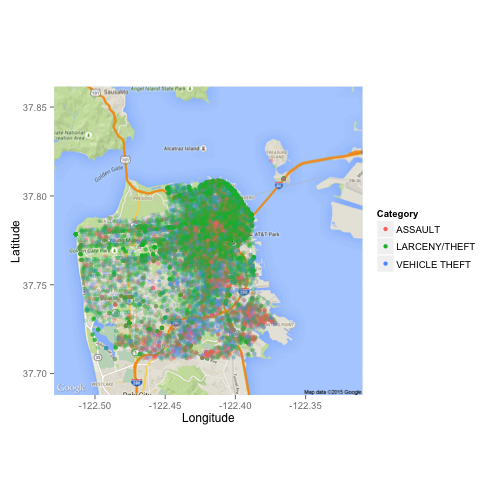
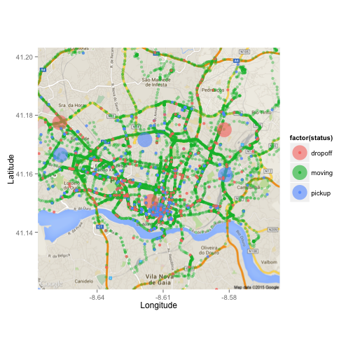

# Spatial Visualization with ggmap   
31 July 2015   
[ggmap](https://cran.r-project.org/web/packages/ggmap/index.html), which is an R package built to visualize with map, is very similar to [ggplot2](http://ggplot2.org/). And its output is ‘ggplot’ class, which means it also support layered visualization just like ggplot2. I will demonstrate with two examples "[Crimes in San Fransisco](https://www.kaggle.com/c/sf-crime/data)" and "[Taxi in Porto](https://www.kaggle.com/c/pkdd-15-predict-taxi-service-trajectory-i/data)". The data of both examples are taken from kaggle.   

## some basics of ggmap:   
1. get_map: is the function to download map from source (e.g. google/openstreetmap).
   
## some parameters can play with:   
1. location: the longitude and the latitude coordinates or the geocode (e.g. ‘San Francisco’)   
2. maptype: could be ‘terrain’, ‘satellite’, ‘roadmap’, ‘hybrid’ … I usually prefer ‘terrain’.   
3. zoom: from 3 (continental level) to 21 (building level). I usually use 10-14 (city level).   
4. ggmap: is the function to plot map, can be appended with ggplot geom function to add layer.   

# Crime in San Fransisco
[This data set](https://www.kaggle.com/c/sf-crime/data) consists of the criminal records of different categories in San Fransisco from 2003 to 2015. Let’s only look at the records in year 2014.   


```r
head(data_2014[c('Category','DayOfWeek','PdDistrict','X','Y','Year')])
```

```
##            Category DayOfWeek PdDistrict         X        Y Year
## 27585 LARCENY/THEFT    Sunday    MISSION -122.4356 37.76080 2014
## 27586 LARCENY/THEFT    Sunday   NORTHERN -122.4336 37.80004 2014
## 27587 VEHICLE THEFT    Sunday    CENTRAL -122.4128 37.78683 2014
## 27588       ASSAULT    Sunday   NORTHERN -122.4217 37.77364 2014
## 27589       ASSAULT    Sunday   NORTHERN -122.4217 37.77364 2014
## 27590       ASSAULT    Sunday   NORTHERN -122.4217 37.77364 2014
```
   
The most frequent crimes are Larceny, other offences, non-criminal, assault and vehicle theft, among which the other offences and non criminal are maybe not so interesting. Therefore I’m going to plot the top 3 crimes with specific categories, namely Larceny, Assault and Vehicle Theft.   

```r
Crime=data.frame(table(data_2014$Category))
Crime=Crime[order(Crime$Freq,decreasing=T),]
head(Crime)
```

```
##              Var1  Freq
## 17  LARCENY/THEFT 18901
## 22 OTHER OFFENSES 10290
## 21   NON-CRIMINAL  9669
## 2         ASSAULT  6254
## 35  VEHICLE THEFT  3564
## 34      VANDALISM  3538
```
    
Use ggmap to plot the map and use geom_jitter to plot the crimes in San Francisco:   

```r
library(ggmap)
map=get_map(location='San Fransico',maptype='roadmap',zoom=12)
```

```
## Map from URL : http://maps.googleapis.com/maps/api/staticmap?center=San+Fransico&zoom=12&size=640x640&scale=2&maptype=roadmap&language=en-EN&sensor=false
```

```r
plot_crime=ggmap(map)+geom_jitter(aes(X,Y,colour=Category),
  data=data_2014[data_2014$Category %in% Top3,],alpha=0.2)+geom_jitter(aes(X,Y,colour=Category),
	data=data0[data0$Category %in% Top3,],alpha=1)+labs(x='Longitude',y='Latitude')
plot_crime
```

 
    
## Some Insights:
There are much more Larceny/Theft (in green) cases in 2014 than the rest two crimes and most of the cases happened in North Coast. Is it because the place is closer to Alcatraz Island? I guess not. The assault crimes (in red) are mostly clustered near Tenderloin, which is indeed a [high-crime neighbourhood](https://en.wikipedia.org/wiki/Tenderloin,_San_Francisco) in San Francisco, quoted from wikipedia. The Vehicle theft crime (in blue) is much less frequent compared with the top 2 and there is no particular worse area.

# Taxi in Porto
[This data set](https://www.kaggle.com/c/pkdd-15-predict-taxi-service-trajectory-i/data) contain a collection of location trajectory of the taxis in Porto, which is the 2nd largest city in Portugal.   
Let’s take a overview of the data:    

```r
head(test[c('TRIP_ID','TAXI_ID','TIMESTAMP','DAY_TYPE','MISSING_DATA')])
```

```
##   TRIP_ID  TAXI_ID  TIMESTAMP DAY_TYPE MISSING_DATA
## 1      T1 20000542 1408039037        A        False
## 2      T2 20000108 1408038611        A        False
## 3      T3 20000370 1408038568        A        False
## 4      T4 20000492 1408039090        A        False
## 5      T5 20000621 1408039177        A        False
## 6      T6 20000607 1408037146        A        False
```
    
This is interesting data, but we are not going to use that. We will only use the last column of the data set, which is the POLYLIN (trajectory of the taxi). We define the first location to be pick-up point and the last location to be drop-off point.

## Pre-Processing  

```r
test$POLYLINE[1]
```

```
## [1] "[[-8.585676,41.148522],[-8.585712,41.148639],[-8.585685,41.148855],[-8.58573,41.148927],[-8.585982,41.148963],[-8.586396,41.148954],[-8.586072,41.14872],[-8.586324,41.147847],[-8.586999,41.14746],[-8.586576,41.147154],[-8.584884,41.146623]]"
```

```r
getCoord=function(x){
  x=gsub('[/[]','',x)
	x=gsub(']','',x)
	x=strsplit(x,',')[[1]]
	n=length(x)
	lon=as.numeric(x[seq(1,n,2)])
	lat=as.numeric(x[seq(2,n,2)])
	df=data.frame(lon=lon,lat=lat)
	df$status='moving'
	df$status[1]='pickup'
	df$status[nrow(df)]='dropoff'
	return(df)
}
```
   
After some pre-processing, we will transform the POLYLINE into a data frame contains series of longitude, latitude, status (pick-up/moving/drop-off).   

```r
loc=NULL
for (i in 1:length(polyline)){
  loc=rbind(loc,getCoord(polyline[i]))
}
head(loc)
```

```
##         lon      lat status
## 1 -8.585676 41.14852 pickup
## 2 -8.585712 41.14864 moving
## 3 -8.585685 41.14885 moving
## 4 -8.585730 41.14893 moving
## 5 -8.585982 41.14896 moving
## 6 -8.586396 41.14895 moving
```
   
Similar we use ggmap to plot the map of Porto with trajectory of taxis overlaid.   

```r
library(ggmap)
map=get_map(location=c(lon=median(loc$lon),lat=median(loc$lat)),
  maptype='roadmap',zoom=13)
```

```
## Map from URL : http://maps.googleapis.com/maps/api/staticmap?center=41.161833,-8.612033&zoom=13&size=640x640&scale=2&maptype=roadmap&language=en-EN&sensor=false
```

```r
plot_taxi=ggmap(map)+labs(x='Longitude',y='Latitude')+
geom_jitter(aes(lon,lat,colour=factor(status)),data=loc[loc$status=='moving',],alpha=0.4)+
geom_point(aes(lon,lat,colour=factor(status)),data=centers,size=10,alpha=0.6)+
geom_jitter(aes(lon,lat,colour=factor(status)),data=loc[loc$status!='moving',],alpha=0.8)
plot_taxi
```

```
## Warning: Removed 2616 rows containing missing values (geom_point).
```

```
## Warning: Removed 1 rows containing missing values (geom_point).
```

```
## Warning: Removed 53 rows containing missing values (geom_point).
```

 
   
## Some Insights:
I’ve never been to Portugal, but I can guess Vitoria is the CBD area or places of attractions in Porto, as the taxi trajectories are very dense at the southern Porto, around the Vitoria.   
There are two main pick-up and drop-off area in the northeast and the northwest, which I guess are two residential area.   
If you noticed there’re some big spots I drew on the map, which are the clustered pick-up and drop-off area with using simple kmeans clustering.   
   
the completed R code is available: [here](https://github.com/6chaoran/DataStory/blob/master/SpotMeOnTheMap.R), if you are interested to check out.
